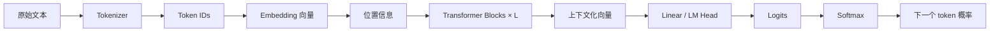
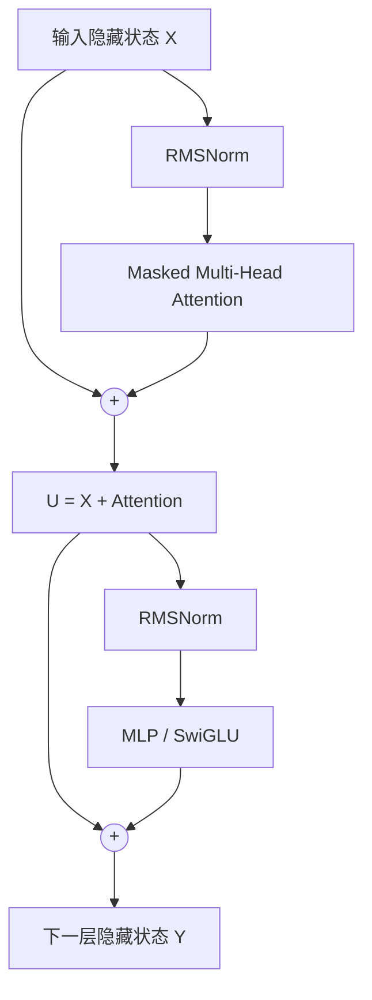

# 从 Token 到 Transformer：大语言模型如何学习与生成

> [!abstract] 核心主线
> 大语言模型先把文字切成 token，将 token 映射为初始向量；Transformer 再让各位置的向量根据上下文交换、整合信息，最后将当前上下文向量转换成“下一个 token”的条件概率。预训练负责把语言规律压缩进模型参数，In-context learning 则通过当前上下文临时改变模型的行为，但不修改参数。

相关课程笔记：[[P1 生成式 AI 是什么]]、[[P3 训练不了人工智能？那我训练自己！]]

## 一、全局流程



以输入 `台湾大` 为例，模型真正计算的是：

$$
P(\text{下一个 token}\mid\text{台湾大})
$$

它可能得到：

```text
学：50%
车：25%
众：8%
门：2%
……
```

如果选择了“学”，上下文变为 `台湾大学`，模型再重新计算下一轮概率。整个生成过程就是不断重复这一动作。

---

## 二、In-context Learning：模型如何在提示词中临时学习

### 1. 定义

**In-context learning（ICL，上下文学习）**是指：模型不修改自身参数，只根据当前提示词中的任务说明、示例和对话历史，临时推断任务规则并产生相应输出。

示例：

```text
输入：开心
输出：正面

输入：糟糕
输出：负面

输入：令人满意
输出：
```

模型可能回答“正面”。它从当前上下文推断出了“进行情感分类”这一任务。

### 2. Zero-shot、One-shot 与 Few-shot

| 形式 | 提示词内容 | 示例数量 |
|---|---|---:|
| Zero-shot | 只有任务说明 | 0 |
| One-shot | 任务说明和一个示例 | 1 |
| Few-shot | 任务说明和少量示例 | 若干 |

### 3. ICL 和训练的区别

| 方式 | 信息放在哪里 | 是否更新参数 | 持续时间 |
|---|---|---:|---|
| In-context learning | 当前提示词和对话历史 | 否 | 通常仅限当前上下文 |
| 微调 Fine-tuning | 训练数据和模型权重 | 是 | 持续保存在模型中 |
| RAG | 外部知识库的检索结果 | 否 | 随每次检索结果变化 |

### 4. ICL 为什么不改参数也能工作

ICL 不会改变模型权重，但会改变 Transformer 当前接收到的 token 序列。不同上下文会产生不同的注意力关系和上下文向量，从而改变下一 token 的概率分布。

可以把两者区分为：

```text
训练：改变模型这个“函数”本身
ICL：函数不变，但给它不同的输入和示例，使计算路径与输出改变
```

> [!important] 关键修正
> “ICL 没有更新参数”不等于“模型无法完成训练资料中没有出现过的具体任务”。只要预训练模型已经具备足够的语言理解、模式识别和组合能力，它就可能从少量示例中推断新映射。ICL 的局限在于这种规则通常不会永久保留，而且很依赖示例质量、顺序和任务难度。

---

## 三、下一个 token 的概率是怎样得到的

### 1. 概率的含义

自回归语言模型学习的是条件概率：

$$
P(x_t\mid x_1,x_2,\ldots,x_{t-1})
$$

完整序列的概率可以分解为：

$$
P(x_1,x_2,\ldots,x_T)
=
\prod_{t=1}^{T}P(x_t\mid x_1,\ldots,x_{t-1})
$$

模型不是直接回答“现实中哪句话是真的”，而是在回答：

> 已经看到这些 token 后，词表中的哪个 token 最像合理的后续？

### 2. 预训练提供了什么

预训练资料中可能包含：

```text
台湾大学是一所著名大学。
他毕业于台湾大学。
台湾大学位于台北市。
```

系统可以自动构造大量训练样本：

```text
输入：台湾
目标：大学

输入：台湾大学
目标：是

输入：台湾大学位于
目标：台北
```

训练初期，模型参数近似随机，预测也近似随机。每次预测后，系统用真实下一个 token 计算损失。常见的单 token 交叉熵是：

$$
L=-\log P(\text{正确 token})
$$

正确 token 的概率越低，损失越大。反向传播和梯度下降会调整 Embedding、Attention、MLP 和输出层的参数，使类似上下文中的正确 token 概率逐渐升高。

### 3. 不是简单查词频

模型在生成时通常不会重新查询训练资料，也不只是统计某个字符串后出现过什么。它会结合整个上下文：

```text
我想申请台湾大……       → “学”很可能
台湾大众运输系统的列…… → “车”可能更合理
```

模型通过参数学习到词语搭配、语法、语义、实体关系和任务模式，因此能组合出训练资料中没有原样出现过的句子。

### 4. Logits 和 Softmax

Transformer 最后一层产生上下文向量 $h$，输出层将它映射到词表大小：

$$
z=W_{\text{vocab}}h+b
$$

$z$ 中的每个数是某个候选 token 的原始分数，称为 **logit**。Softmax 将 logits 转成总和为 1 的概率：

$$
P_i=\frac{e^{z_i}}{\sum_j e^{z_j}}
$$

生成时可以始终选择最大概率 token，也可以按概率随机采样。Temperature 会改变分布的尖锐程度：

$$
P_i(T)=\frac{e^{z_i/T}}{\sum_j e^{z_j/T}}
$$

- $T$ 较低：输出更稳定、保守；
- $T$ 较高：输出更多样，但更容易偏离；
- $T\to 0$：近似总选最大 logit。

> [!warning] 概率不等于事实可信度
> token 概率高，只说明它在当前上下文中是很自然的后续，不保证整句话在现实中为真。语言流畅、模型自称“有 90% 把握”，也不等于经过可靠校准。

---

## 四、Token 如何变成向量

### 1. Tokenizer：从文字到整数 ID

输入：

```text
我喜欢台湾大学
```

某个 tokenizer 可能切成：

```text
["我", "喜欢", "台湾", "大学"]
```

然后根据固定词表映射成 ID：

```text
我    → 15
喜欢  → 274
台湾  → 8312
大学  → 4920
```

这些 ID 只是编号，不表示大小、距离或语义。

### 2. Embedding Table：用 ID 查表

假设词表有 $V$ 个 token，每个向量维度为 $d$，模型拥有可训练矩阵：

$$
E\in\mathbb{R}^{V\times d}
$$

token ID 为 $t$ 时，初始向量就是矩阵的第 $t$ 行：

$$
x=E[t]
$$

概念代码：

```python
embedding = torch.nn.Embedding(vocab_size, hidden_size)
vectors = embedding(token_ids)
```

如果输入有 $n$ 个 token，得到的矩阵形状是：

$$
X\in\mathbb{R}^{n\times d}
$$

### 3. Embedding 是如何学会语义的

Embedding 在训练开始时通常是随机的。预测错误产生的梯度会不断修改矩阵 $E$。在相似上下文中频繁出现的 token，会逐渐形成某些相似的几何关系。

语义通常是**分布式表示**：不是“第 1 维代表国家、第 2 维代表城市”，而是大量维度共同表达一个概念，一个维度也会参与多个概念。

两个向量的方向相似程度常用余弦相似度衡量：

$$
\cos(a,b)=\frac{a\cdot b}{\|a\|\|b\|}
$$

### 4. 初始向量与上下文化向量

同一个 token 每次查表得到的初始 embedding 通常相同：

```text
我吃了一个苹果。
苹果发布了新电脑。
```

两个“苹果”最初使用同一向量；经过 Transformer 后，第一个会吸收“吃了”等信息，第二个会吸收“发布”“电脑”等信息，最终成为不同的上下文化向量。

```text
静态 embedding：token 本身的初始表示
contextual representation：token 在当前上下文中的表示
```

---

## 五、Transformer 的核心机理

### 1. Transformer 的职责

Embedding 只提供初始表示。Transformer 通过反复执行两类操作，使每个 token 获得上下文：

1. **Self-Attention**：决定从其他 token 收集哪些信息；
2. **MLP / Feed-Forward**：对收集到的信息进行非线性加工。

Residual connection 和 Normalization 使这个过程能够稳定地堆叠很多层。

### 2. Decoder-only 数据流



这是一种常见的现代 pre-norm 写法：

$$
U=X+\operatorname{Attention}(\operatorname{RMSNorm}(X))
$$

$$
Y=U+\operatorname{MLP}(\operatorname{RMSNorm}(U))
$$

原始 2017 Transformer 使用的归一化位置与许多现代模型不同，因此不同资料中的结构图可能略有差异。

### 3. Self-Attention：动态信息检索

输入矩阵 $X$ 会通过三组可训练矩阵产生 Query、Key、Value：

$$
Q=XW_Q,\qquad K=XW_K,\qquad V=XW_V
$$

直观理解：

| 向量 | 作用 | 类比 |
|---|---|---|
| Query | 当前位置想寻找什么信息 | 搜索请求 |
| Key | 当前 token 能以什么特征被匹配 | 索引标签 |
| Value | 被关注后实际提供什么信息 | 检索内容 |

位置 $i$ 对位置 $j$ 的原始匹配分数是：

$$
s_{ij}=\frac{q_i\cdot k_j}{\sqrt{d_k}}
$$

除以 $\sqrt{d_k}$ 是为了避免维度增大后点积数值过大，导致 softmax 过度饱和。

加入遮罩并做 softmax：

$$
A=\operatorname{softmax}\left(\frac{QK^\top}{\sqrt{d_k}}+M\right)
$$

最后对 Value 加权求和：

$$
O=AV
$$

因此 Attention 可以概括为：

```text
Q 和 K 决定“关注谁以及关注多少”
V 决定“从被关注的位置取回什么内容”
```

### 4. Causal Mask：禁止偷看未来

GPT、Llama 等 decoder-only 模型进行自回归生成。位置 $i$ 只能访问自己和之前的位置：

$$
M_{ij}=
\begin{cases}
0,&j\le i\\
-\infty,&j>i
\end{cases}
$$

Softmax 后，未来 token 的注意力权重变为 0：

```text
查询位置：大学

台湾：可见
大学：可见
位于：masked
台北：masked
```

### 5. Multi-Head Attention

模型不会只进行一次注意力计算，而是使用多组独立投影：

$$
\operatorname{head}_h
=
\operatorname{softmax}
\left(
\frac{Q_hK_h^\top}{\sqrt{d_k}}+M
\right)V_h
$$

各注意力头连接后再投影：

$$
\operatorname{MHA}(X)
=
\operatorname{Concat}(\operatorname{head}_1,\ldots,\operatorname{head}_H)W_O
$$

不同头可以在不同子空间捕捉局部搭配、指代、远距离依赖等关系。但“某个头固定负责语法”只是方便理解的说法，真实模型中的功能通常并不如此清晰，多个头也可能冗余或协作。

### 6. MLP：逐位置进行非线性加工

Attention 负责在 token 之间交换信息，MLP 则对每个位置分别使用同一套网络：

$$
\operatorname{MLP}(x)=W_2\,\sigma(W_1x+b_1)+b_2
$$

现代模型常使用 SwiGLU 等门控结构。可建立如下直觉：

```text
Attention：应该读取上下文中的什么信息？
MLP：读到这些信息后应该怎样识别、组合和变换？
```

### 7. Residual Connection 与 Normalization

残差连接：

$$
y=x+f(x)
$$

它让每一层只需学习“对原表示的修正”，同时为信息和梯度提供直接通路。LayerNorm 或 RMSNorm 则控制数值尺度，使深层网络训练更稳定。

### 8. 位置信息

Attention 本身不会天然区分：

```text
猫追狗
狗追猫
```

所以模型必须注入位置信息。常见方法包括：

- 原始 Transformer 的正弦位置编码；
- 可学习的位置向量；
- Llama 等模型常用的 RoPE（Rotary Position Embedding）。

RoPE 通过与位置相关的旋转作用于 Query 和 Key，使注意力分数同时包含 token 内容、位置及相对距离。

### 9. 为什么要堆叠很多层

一层 Attention 已能让某个 token 直接读取任意较早位置；多层的意义主要不是单纯扩大视野，而是进行多轮信息提取、组合和变换。

可以建立一个不严格但有用的直觉：

```text
较浅层：局部形式、相邻关系、词法特征
中间层：句法关系、实体关系、上下文组合
较深层：任务信息、抽象语义、用于预测的综合表示
```

真实模型并没有绝对清晰的层级分工。

---

## 六、一个端到端例子

输入：

```text
台湾大学位于台北
```

1. Tokenizer 将文字切成 token 并映射为 ID；
2. Embedding table 把 ID 变成初始向量；
3. RoPE 等机制给 Attention 注入位置信息；
4. 每层 Attention 让当前位置读取之前的相关 token；
5. 每层 MLP 对读取后的表示进行非线性加工；
6. Residual 与 RMSNorm 保证深层计算稳定；
7. 最后一层中，“台北”所在位置的向量已经包含整段前文信息；
8. LM Head 将该向量映射为整个词表的 logits；
9. Softmax 得到下一个 token 概率；
10. 模型选择或采样一个 token，例如“市”，再进入下一轮。

这说明“模型预测下一个字”并不等于只看相邻字做简单接龙。为了在海量、复杂的文本中持续猜对，模型必须学习语法、语义、实体关系、任务结构以及许多可组合的模式。

---

## 七、训练与生成为什么不同

### 1. 训练可以并行

完整训练文本已经存在，因果遮罩可以保证每个位置不偷看未来，同时让 GPU 一次计算所有位置的预测：

```text
台湾           → 预测 大学
台湾大学       → 预测 位于
台湾大学位于   → 预测 台北
台湾大学位于台北 → 预测 下一个 token
```

### 2. 生成必须串行

生成时未来 token 尚不存在：

```text
生成 token 1
→ 加入上下文
→ 生成 token 2
→ 加入上下文
→ ……
```

KV Cache 会缓存历史 token 的 Key 和 Value，避免每一步重新计算全部前文，但新 token 仍需按顺序产生。

---

## 八、Transformer 的三类常见架构

| 架构 | 注意力范围 | 典型模型 | 常见用途 |
|---|---|---|---|
| Encoder-only | 同时看左右上下文 | BERT | 分类、理解、向量表示 |
| Decoder-only | 使用因果遮罩，只看当前及前文 | GPT、Llama、Qwen | 自回归生成、对话 |
| Encoder–Decoder | Encoder 读输入，Decoder 生成输出 | 原始 Transformer、T5 | 翻译、摘要、序列到序列 |

学习现代聊天模型时，应重点理解 **decoder-only Transformer**。原始论文中的完整 Encoder–Decoder 架构不等同于 GPT 的具体结构。

---

## 九、常见误区

1. **Token ID 不是向量。** ID 只是词表编号，Embedding table 才将其映射成向量。
2. **Embedding 不等于最终语义。** 初始 embedding 是静态的，Transformer 输出的上下文化向量才会随语境改变。
3. **概率不是从训练资料中现场查出的词频。** 它是模型参数和当前上下文共同计算的结果。
4. **注意力权重不一定是可靠解释。** 高权重说明计算上使用较多，不必然等于人类意义上的“原因”。
5. **ICL 不修改模型参数。** 它通过上下文改变中间表示和输出概率，而不是让模型永久学会新知识。
6. **流畅不等于正确。** 模型优化的是下一个 token 的条件概率，不是直接优化事实真实性。
7. **能看到长上下文不等于能同等有效地利用每一部分。** 位置、干扰信息和上下文长度都会影响效果。
8. **Attention 不是 Transformer 的全部。** MLP、残差连接、归一化、位置编码和训练目标同样关键。

---

## 十、Transformer 的优势与局限

### 优势

- 内容驱动的信息路由：每个 token 动态决定关注谁；
- 训练阶段高度并行，适合 GPU；
- 容易扩大模型宽度、深度、数据量和上下文；
- 同一架构可以用于文本、图像、语音及多模态任务。

### 局限

- 标准 Attention 的时间与显存复杂度约为 $O(n^2)$；
- 自回归生成仍然需要逐 token 串行执行；
- 语言概率不保证事实真实性；
- 长上下文中可能出现信息遗忘或利用不均；
- 内部表示是分布式的，难以完全解释；
- 训练需要巨量数据、算力和工程资源。

---

## 十一、推荐学习资料

### 建立直觉

1. [The Illustrated Transformer](https://jalammar.github.io/illustrated-transformer/)：适合先建立整体图像直觉。
2. [3Blue1Brown：Transformer 可视化讲解](https://www.youtube.com/watch?v=wjZofJX0v4M)：重点解释向量、Attention 与 GPT。

### 结合代码理解

3. [Andrej Karpathy：Let's build GPT](https://www.youtube.com/watch?v=kCc8FmEb1nY)：从零实现小型 GPT。
4. [The Annotated Transformer](https://nlp.seas.harvard.edu/annotated-transformer/)：将论文公式和 PyTorch 代码逐段对应。

### 阅读原始论文

5. [Attention Is All You Need](https://arxiv.org/abs/1706.03762)：Transformer 原始论文。
6. [RoFormer / RoPE](https://arxiv.org/abs/2104.09864)：旋转位置编码论文。
7. [Chain-of-Thought Prompting](https://arxiv.org/abs/2201.11903)：Few-shot ICL 如何引导推理过程。
8. [Language Models are Few-Shot Learners](https://arxiv.org/abs/2005.14165)：GPT-3 与 In-context learning 的经典论文。

### 推荐学习顺序

```text
Illustrated Transformer
→ 3Blue1Brown
→ Karpathy: Let's build GPT
→ Annotated Transformer
→ 原始论文与 RoPE
```

---

## 十二、复习检查

完成本笔记后，应能独立回答：

- 为什么 token ID 本身不包含语义？
- Embedding table 是怎样通过预训练得到语义结构的？
- 静态 embedding 和 contextual representation 有什么区别？
- Query、Key、Value 分别负责什么？
- 为什么点积要除以 $\sqrt{d_k}$？
- Causal Mask 为什么能阻止模型偷看未来？
- Multi-Head Attention 为什么比单头更有表达力？
- Attention、MLP、Residual、RMSNorm 分别解决什么问题？
- 为什么训练可以并行，而生成仍需逐 token 进行？
- ICL 为什么不改参数也能改变模型行为？
- 为什么高 token 概率不等于事实正确？

> [!summary] 一句话总结
> 预训练把海量文本中的规律压缩进参数；Tokenizer 和 Embedding 把文字转换为初始向量；Transformer 通过 Attention 和 MLP 将其变成上下文化表示；输出层再把当前表示转换为下一个 token 的概率，而 ICL 则利用当前上下文临时引导这一整套计算过程。
