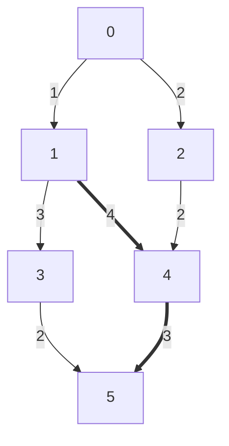

> 🔗[416 - 有向无环图的最长路](https://sunnywhy.com/camp/3415/model/3590?itemId=2996)

## 📌 题目描述
> （请在此处粘贴题目描述）

### 题目描述
现有一个共 $n$ 个顶点、$m$ 条边的有向无环图（假设顶点编号为从 $0$ 到 $n-1$），求图的所有路径中边权之和的最大值（不固定起点和终点）。

### 输入描述
第一行两个整数 $n、m$（$1 \le n \le 100, 0 \le m \le n(n-1)$），分别表示顶点数、边数；
接下来 $m$ 行，每行三个整数 $u、v、w$（$0 \le u \le n-1, 0 \le v \le n-1, u \neq v, 1 \le w \le 100$），表示一条边的起点和终点的编号及边权。数据保证不会有重边。

### 输出描述
输出一个整数，表示路径上边权之和的最大值。

### 样例1
**输入**
6 7
0 1 1
0 2 2
1 3 3
1 4 4
2 4 2
3 5 2
4 5 3

**输出**
8

对应的有向无环图如下，**加粗的边**即为最长路径，其边权之和为：
$$1 + 4 + 3 = 8$$




## 💡 解题思路 
初始化图`g`边权值为`INT_MAX`表示任意两个顶点之间不能到达，输入顶点与边权之后，使用 `dfs(i)` 表示可以从顶点 `i` 出发可以得到的最大路径长度。遍历每个顶点求最大值。如果`g[i][j]`不是`INT_MAX`，说明有边可以从顶点`i` 到 `j`，更新$dfs(i) = max(dfs(i), dfs(j) + g[i][j])$。
## 💻 代码实现
> my answer

记忆化搜索。
```cpp
#include <iostream>
#include <algorithm>
#include <cstring>
#include <climits>

using namespace std;
const int N = 110;
int n,m;
int g[N][N];
bool st[N]; // 初始为false
int memo[N];

// dfs(i) 表示从i出发能得到的最大路径长度
int dfs(int i) {
    if (st[i]) { // 这个点在别的路径上出现
        return memo[i]; // 则直接返回
    }
    st[i] = true;
    int res = 0;
    for (int j = 0; j < n; j++) {
        if (g[i][j] != INT_MAX) {
            // 有边可以走
            res = max(res, dfs(j) + g[i][j]);
        }
    }
    memo[i] = res;
    return res;
}

int main()
{
    // 初始化图
    fill(g[0], g[0] + N * N, INT_MAX);
    cin >> n >> m;
    for (int j = 0; j < m; j++) {
        int u, v, w;
        cin >> u >> v >> w;
        g[u][v] = w;
    }
    
    int ans = 0;
    for (int i = 0; i < n; i++) {
        ans = max(ans, dfs(i));
    }
    cout << ans << endl;

    return 0;
}
```
- **时间复杂度**：$O(N^2)$。
**详细分析：**
*   **状态总数**：`memo` 数组的大小为 $N$，代表共有 $N$ 个状态（每个节点出发能得到的最大长度）。
*   **单个状态的计算成本**：
    *   在 `dfs(i)` 函数中，有一个 `for` 循环遍历所有可能的下一个节点 `j` (`0` 到 `n-1`)。
    *   循环次数固定为 $N$ 次。
    *   由于使用了记忆化 (`if (st[i]) return memo[i];`)，每个节点的 `dfs` 函数体**最多只会被完整执行一次**。后续再次调用该节点时，直接 $O(1)$ 返回。
*   **总操作数**：
    *   主函数中调用 `dfs(i)` $N$ 次，但只有第一次调用会触发实际计算。
    *   所有 `dfs` 函数内部的循环加起来，总共遍历了 $N \times N$ 次边（因为是用邻接矩阵存储，即使没有边也要检查 `g[i][j] != INT_MAX`）。
    *   因此，总时间复杂度为 **$O(N^2)$**。

> **注意**：如果图是使用**邻接表**存储的，且边数为 $E$，那么时间复杂度可以优化到 $O(N + E)$。但在你的代码中，使用的是邻接矩阵 `g[N][N]`，所以必须扫描每一行所有的 $N$ 个元素，导致复杂度锁定在 $O(N^2)$。
- **空间复杂度**：$O(N^2)$。
**详细分析：**
*   **邻接矩阵**：`int g[N][N]` 占据了主要空间，大小为 $N \times N$，即 **$O(N^2)$**。
*   **辅助数组**：
    *   `bool st[N]`：$O(N)$。
    *   `int memo[N]`：$O(N)$。
*   **递归栈**：
    *   最坏情况下（例如一条链 $0 \to 1 \to 2 \dots \to N-1$），递归深度为 $N$。
    *   占用空间：$O(N)$。
*   **结论**：主导项是邻接矩阵，故总空间复杂度为 **$O(N^2)$**。

> to optimize

翻译成递推。
```cpp
#include <iostream>
#include <algorithm>
#include <cstring>
#include <climits>

using namespace std;
const int N = 110;
int n,m;
int g[N][N];
int f[N];

// 计算从i出发能得到的最大路径长度
int getLength(int i) {
    if (f[i]) { // 这个点在别的路径上出现
        return f[i]; // 则直接返回
    }
    for (int j = 0; j < n; j++) {
        if (g[i][j] != INT_MAX) {
            // 有边可以走
            f[i] = max(f[i], getLength(j) + g[i][j]);
        }
    }
    return f[i];
}

int main()
{
    // 初始化图
    fill(g[0], g[0] + N * N, INT_MAX);
    cin >> n >> m;
    for (int j = 0; j < m; j++) {
        int u, v, w;
        cin >> u >> v >> w;
        g[u][v] = w;
    }

    int ans = 0;
    for (int i = 0; i < n; i++) {
        ans = max(ans, getLength(i));
    }
    cout << ans << endl;

    return 0;
}
```
- **时间复杂度**：$O(N ^ 2)$
- **空间复杂度**：$O(N ^ 2)$

>✨ tips

> others' answer

```cpp
// 判断是否是有向无环图 + 递推
#include <iostream>
#include <vector>
#include <algorithm>
#include <climits>

using namespace std;

const int N = 110;
int n, m;
// 为了递推方便，这里依然可以用邻接矩阵，或者改用邻接表
// 既然原题用矩阵，这里保持矩阵以展示逻辑对应，但实际推荐邻接表
int g[N][N]; 
int dp[N];   // dp[i] 表示从 i 出发的最长路径长度
int topo[N]; // 存储拓扑排序的结果
int indegree[N]; // 入度数组，用于拓扑排序

int main() {
    // 1. 初始化
    fill(g[0], g[0] + N * N, INT_MAX);
    fill(indegree, indegree + N, 0);
    
    cin >> n >> m;
    for (int i = 0; i < m; i++) {
        int u, v, w;
        cin >> u >> v >> w;
        g[u][v] = w;
        indegree[v]++; // 统计入度
    }

    // 2. 拓扑排序 (Kahn 算法)
    // 只有 DAG 才能完成拓扑排序。如果有环，排序后的节点数会 < n
    vector<int> q;
    for (int i = 0; i < n; i++) {
        if (indegree[i] == 0) {
            q.push_back(i);
        }
    }

    int head = 0;
    while(head < q.size()){
        int u = q[head++];
        topo[head-1] = u; // 记录拓扑序
        
        for (int v = 0; v < n; v++) {
            if (g[u][v] != INT_MAX) {
                indegree[v]--;
                if (indegree[v] == 0) {
                    q.push_back(v);
                }
            }
        }
    }

    // 检查是否有环 (可选)
    if (q.size() < n) {
        cout << "图中存在环，无法使用简单递推求最长路" << endl;
        return 0;
    }

    // 3. 递推 DP
    // 初始化 dp 数组
    for (int i = 0; i < n; i++) dp[i] = 0;

    int ans = 0;

    // 【关键】：逆着拓扑序枚举
    // 拓扑序是：起点 -> ... -> 终点 (出度为0的点在最后)
    // 我们的 dp[i] 依赖后继，所以要【从后往前】算，确保算 i 时，它的后继都算好了
    for (int k = n - 1; k >= 0; k--) {
        int i = topo[k]; // 当前节点
        
        // 尝试更新所有后继
        for (int j = 0; j < n; j++) {
            if (g[i][j] != INT_MAX) {
                // 状态转移方程：dp[i] = max(dp[i], dp[j] + w)
                // 此时 dp[j] 一定已经计算过了，因为 j 在拓扑序中位于 i 之后，
                // 而我们是逆序遍历，所以 j 比 i 先被处理。
                dp[i] = max(dp[i], dp[j] + g[i][j]);
            }
        }
        
        ans = max(ans, dp[i]);
    }

    cout << ans << endl;

    return 0;
}
```
- **时间复杂度**：$O(N^2)$
- **空间复杂度**：$O(N^2)$

>✨ tips

## 🔁 复盘与扩展
> 关键点：

> 易错点：

## 🔗 相关题目


> ⏱️ 本次耗时：__40__ 分钟
